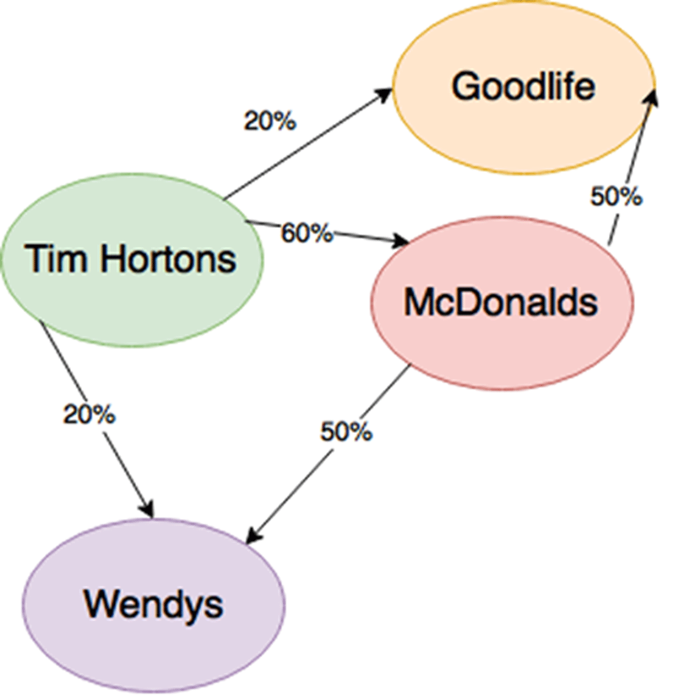

Having gained a solid grasp of both the problem and solution domains it was time to move towards implementation. How do we achieve effective next place prediction using MobilityTraces only containing Visits to commercial POIs? Given that trip prediction is a subset of the general mobility problem I figured it was unnecessary to reinvent the wheel, so I started researching techniques that consider complete MobilityTraces. After reviewing the literature, I landed on Markov Chains as the basis of my implementation. While there are techniques involving neural networks that are slightly more accurate, they don't pay dividends considering their complexity and required computing power. The drivers of human mobility are not so involved as to need neural layers to capture them.

  

**Mobility Markov Chains**

A Markov Chain is a stochastic model in which the frequency of transition between states governs the probability distribution of the random variable. Many subdisciplines of A.I. use Markov Chains in some way or another, and every application has its domain-specific nomenclature. In the mobility context, we adopt the name Mobility Markov Chain (MMC). MMCs have an intuitive visualization as a state diagram as seen below.

In this MMC the nodes signify state (a specific POI) while the labels of the directed edges represent the probability of transition from one POI to the next. The simplest way to train an MMC is to record the counts of past transitions between two states using a set of training data (MobilityTrace). At prediction time we can build a probability distribution by looking at all the edges connected to the current state.

The MMC above considers one piece of context, the current POI, to define the state of the system. However, we could consider more context in our predictions and calculate the transition probabilities not just based on a single edge put on a path. Let us define some new terminology to describe the amount of context used in the calculation of the transition probabilities.    

 _Let an (N-MMC) be an MMC in which we calculate probabilities for paths of length N-1._

_Let a sequence of Visits to specific POIs be called an n-visit where n is the number of POIs as a numeral prefix._

**Rationalizing N-MMC For Trip Prediction**

Why do we consider context at all when making predictions? Why not just use a 1-MMC in which our state diagram devolves into a bubble chart? While a 1-MMC does capture preference, it fails to account for the structure of the data. Remember that time determines the order of the Visits in a MobilityTrace and if we don’t consider the order of the Visits we miss out on the hidden features that govern human mobility like the distance between POIs and POI Category.

Consider the bi-visit “McDonalds SplashWorld” This would be very rare because most people do not like to eat immediately before going swimming. This rule would be part of what I call a “mobility grammar.” Another rule that most people follow is that they visit POIs near each other or on their trajectory of travel. As mobility grammars are far from universal, we do not write these rules but capture them empirically through building N-MMCs.

The most important characteristic of an N-MMC is that it obeys the Markov Property allowing us to consider only a limited amount of context. If we consider too much context, we will have a data sparsity problem in which the training examples will be insufficient to make accurate predictions. Conversely, if we use too little context, then we may not capture essential relationships. While we know in the case of general mobility modelling, it is best to go with a 2-MMC model it is unclear how much context is best when it comes to trip prediction. My intuition was that a similar amount of context would be appropriate; however, this was only a hypothesis that needed validation to ensure the correct parameter be selected. We validate this hypothesis in the next section through empirical means.

**Calculating Conditional Probability**

Now I want to explain how we can calculate the probabilities of transition for a given N-MMC. We are going to approach this calculation more formally so bear with me.

_Let the occurrence of an n-Visit as defined above be analogous to an event in the probability space_ 

_Markov Assumption: Let P(Sk|S1S2S3…Sk-1) approx equal_ _P(Sk|Sk+1-n…Sk-1)  for N > 1_

Consider a MobilityTrace containing the sequence of Visits: “McDonald’s Walmart Starbucks FedEx.” In a 3-MMC model the probability of the sequence “FedEx” is only dependent on the sequence “Walmart Starbucks” appearing before it. Thus, we ignore McDonald's and can write the conditional probability as:

_P(FedEx | Walmart Starbucks) = P(Walmart Starbucks FedEx)/P(Walmart Starbucks)_

To calculate this probability, our model must contain counts of n-visits. To find the conditional probability, we will need to find the probability of the bi-visit “Walmart Starbucks” and the tri-visit “Walmart Starbucks FedEx.” We calculate these probabilities by counting how often they occur in the training data. Note that in a 3-MMC we must only actually store the tri-visits as we can derive bi-visit counts of “Walmart Starbucks” just by adding up all tri-visits that contain that bi-visit.

_Let C(x) be a count function for a specific n-visit_   
_Let T be the number of n-visits in the MobilityTrace with length indicated by the subscript_  
_P (Walmart Starbucks FedEx) = C(Walmart Starbucks FedEx)/T3_  
_P(Walmart Starbucks) = C(Walmart Starbucks)/T2_  
_\* Together then: P(FedEx | Walmart Starbucks) = C(Walmart Starbucks FedEx)/N3 / C(Walmart Starbucks)/N2_

We can simplify \* because N2 will always be one more than N3. For large counts this tiny difference will not significantly impact the probability- we almost have symmetry. Let us use a concrete example to prove this.

_MobilityTrace: “Walmart Starbucks is Walmart Starbucks and when Walmart Starbucks FedEx he howls”_  
_C(Walmart Starbucks FedEx) = 1_  
_C(Walmart Starbucks) = 3_  
_N3 = 10 and thus N2 must equal 11_  
_Proof: 1/10 / 3/11 approximately equal to 1/3_

**Making Predictions**

We have seen thus far how we find the probability for a specified state given context but what if we have context and need to make a prediction? Consider the context “Walmart Starbucks,” how do we decide which state comes next? We use our Ngram model to build a probability distribution using the counts of all tri-visits which start with the bi-visit 'Walmart Starbucks.'

_Walmart Starbucks Costco =2_   
_Walmart Starbucks Shell = 3_   
_Walmart Starbucks Lowe’s  =4_   
_This yields a distribution with 2/9, 3/9, 2/9._

Looking at this distribution, we would choose “Lowe’s” as the most likely next state because it has the highest probability. Utilizing an N-MMC in such a way is called Maximum Likelihood Estimation (MLE).

By now we should have a solid understanding of the N-MMC- a powerful tool for next place prediction. In the following article, we will tailor this tool for trip prediction.
