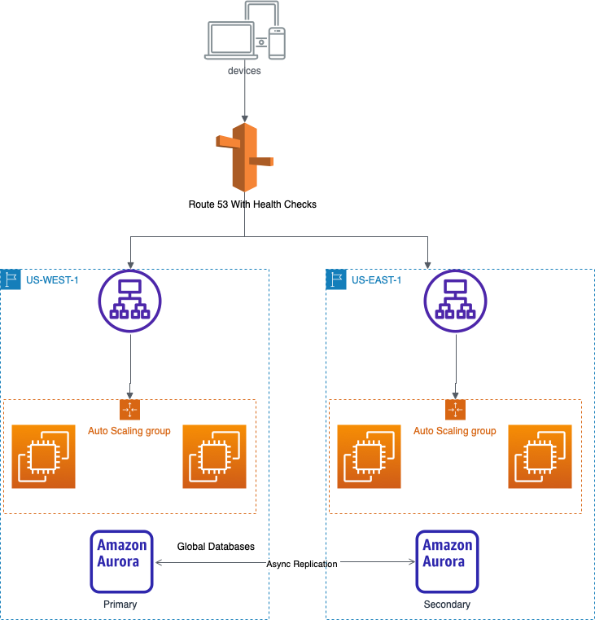

A vast majority of AWS services are region scoped and can withstand the failure of an AZ with ease. Take S3, for example. If we request an object stored in the North California region and AZ-A is knocked offline due to an earthquake, S3 transparently serves a copy from AZ-B or AZ-C. But what happens if a configuration error impairs the service at a regional level? How well do modern applications handle regional cloud service outages? Based on reporting from the December 7th, 2021 N.Virginia region disruption, not very well. Everything from Slack to Roomba vacuums faced outages because of poor architectural choices.  

Although regional outages are rare, some business applications cannot accept even an hour of downtime. The problem seems particularly acute in the fast-expanding IOT segment, where performance is paramount. Today we will explore how to build multi-region architectures on AWS to achieve regional level high availability.

  

***Replicating Data***

The first step in designing a multi-region architecture is ensuring that the data used by our applications is replicated across multiple regions. Luckily, we can take advantage of some built-in AWS features to help.

  

**RDS**

All database engines supported by RDS (including Aurora) support cross-region read replicas. Read replicas are updated asynchronously and can manually be promoted to do writes in the event of a regional failure.

If using Aurora, we also have the option of Aurora Global Databases, which allows Aurora clusters across different regions to stay in sync. In a regional failure, you can promote a secondary cluster to do writes in around a minute.

  

**DynmoDB**

DynmoDB Global Tables supports full read-write capability in each replicated region and automatically resolves conflicts. Global Tables is powered under the hood by DynmoDB Streams.

  

**S3**

S3 provides cross-region replication. A few important things to remember.

1\. Not retroactive

2\. No chaining (not transitive)

3\. Replication is not the same as syncing. i.e.) if you delete an object in the replicated bucket, it will not be deleted in the source bucket.

  

**EFS**

As of January 2022, EFS now supports the ability to do replication across regions and to failover between them.

  

***For Those That Don't Replicate***

Most AWS services cannot do any cross-region replication. Why would that be? From an engineering perspective, a regional service that offers cross-region capabilities increases the coupling between instances of said application. Managing coupled services is more difficult because maintenance must be coordinated and carries a higher risk for cascading faults. Also, consider that latency between regions is higher than between AZs, naturally limiting the types of services offered with global support in a performant manner.

How do we make services bound to a specific region like API Gateway or Lambda available across regions to ensure regional HA?

  

  

  

  

Suppose a web application is served by a fleet of EC2 instances behind an ELB. Application data is stored in an Aurora database, which has already been made multi-regional using Aurora Global Databases. We launch our compute infrastructure twice in two different regions and use Route 53 to route traffic to them. We must assign health checks to each record so that traffic will not be sent to the impaired region in case of failure.

Route 53 is one way to route traffic between applications deployed in multiple regions but not the best way. Global Accelerator can provide faster failover by using Multicast IPs to do routing at the IP layer instead of relying on DNS. Unlike Route53, Global accelerator is not suspectable to DNS caching issues. When a health check fails, traffic is immediately routed to another region. 

  

***Conclusion***

Now is the time to evaluate your organization's application architecture to ensure HA across regions. Although regional outages may only last a few hours a year, the bad impression you impart on your customers sticks around. Make good architectural choices today, so no Roomba vacuum misses a cleaning again.
