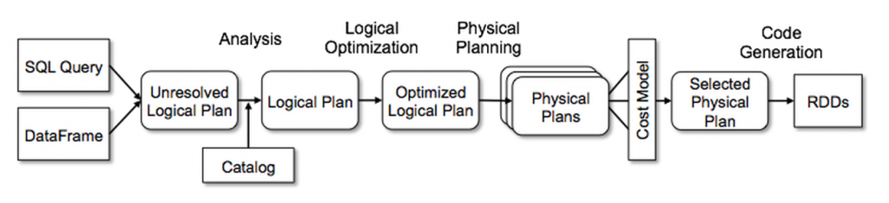

## Intro

Snowflake originally emerged from traditional database and data warehouse systems. In its early days, it offered a sleek, high-performance data warehouse designed to handle OLAP use cases using familiar SQL. By leveraging the cloud, Snowflake brought massive scalability to the table, making it easy for companies to centralize their data, support business intelligence, reporting, and enable large-scale ad hoc data exploration.
Even though Snowflake still refers to its processing unit as a “Data Warehouse,” the term has become somewhat misleading. Over the past few years, Snowflake has evolved into something closer to a general-purpose big data processing engine, more akin to Spark.

To illustrate this shift, let’s look back at how Spark and Snowflake compared when they first hit the scene around 2014. This won’t be an exhaustive comparison, but we’ll focus on the key features and use cases that set these systems apart.

### Original Incarnation: Snowflake vs Spark Qualities

| Technology | Snowflake | Spark |
| --- | --- | --- |
| Primary Abstraction | Database Objects (tables)|RDD (Resilient  Distributed Dataset) |
|ACID Transactions |Yes|No|
Time Travel|Yes|No|
|Ease of use|Easy|Hard|
|Performance|Great out of the box | Huge range depending on level of expertise|
|Structured/Semi Structured Data Support|Yes|No|
|Unstructured Data Support|No|Yes|
|Concurrent Access|Yes|Yes|
|Streaming Data|No|Yes|
|Primary API Language(s)|SQL|SQL, Java, Scala, Python|

### Original Use Cases

Initially, Spark provided out-of-the-box support for machine learning and graph processing with its in-memory computation model. It was also highly efficient for large-scale ETL, particularly due to its flexibility in handling unstructured data and the availability of advanced performance tuning. Snowflake, on the other hand, was better suited for traditional business intelligence, offering a user-friendly SQL interface and highly performant, scalable queries. It was commonly used after ETL processes to further prepare data for business reporting or ad-hoc analytical queries.

Let’s take a journey and explore how Snowflake’s “Data Warehouses” have evolved into something quite different, making the term a bit of a misnomer.

## The Journey

### Spark Finds Some Structure

Spark actually became more like Snowflake before Snowflake started becoming more like Spark. RDDs (Resilient Distributed Datasets) were a powerful but challenging abstraction to work with. As a lower-level abstraction, RDDs offered a great deal of flexibility, which could lead to impressive performance in the right hands—or, if not used carefully, to inefficient, slow queries. People from the database world were used to RDBMS systems handling a lot of the optimization behind the scenes, allowing them to express queries in the way that made the most sense without worrying about performance nuances.

Working with structured or semi-structured data using RDDs was even more complicated, as RDDs were not schema-aware and didn’t inherently understand relationships between data. To bridge this gap and make Spark more approachable, they evolved Spark SQL by introducing the Catalyst Optimizer. The optimizer brought in the kinds of optimizations you’d expect in a traditional data warehouse when querying structured data, like predicate pushdown, cost-based optimization, and both logical and physical query planning.



 

Next Spark introduced the DataFrame API, accessible through general-purpose languages like Python, Java, and Scala. This API exposed the power of Spark SQL and the Catalyst optimizer, offering familiar methods that mirror typical SQL operations. 

Let’s take a look at a query both using DataFrames and Spark SQL.  

```
# Assuming you have a DataFrame 'employees'

# DataFrame API Query
filtered_df = employees.filter(employees.salary > 50000) \
                       .select("name", "salary") \
                       .orderBy(employees.salary.desc())

# Show the result
filtered_df.show()

```

Now using SQL directly. 
 ```
# Assuming you have a DataFrame 'employees'
# Register the DataFrame as a SQL temporary view
employees.createOrReplaceTempView("employees")

spark.sql("""
    SELECT name, salary
    FROM employees
    WHERE salary > 50000
    ORDER BY salary DESC
""").show()
```

Today, most users interact with the DataFrame API because it lets them write efficient queries for both structured, semi-structured, and unstructured data without needing deep optimization skills. On top of that, it’s intuitive for anyone with a background in databases.


### A Common Language

In 2021, Snowflake took a huge step toward becoming a more general big data processing platform with the introduction of Snowpark. This suite of non-SQL tools included a DataFrame API that was very similar to Spark, but with one key difference—it executed within Snowflake’s Data Warehouse. This allowed developers to use familiar programming languages like Python, Java, and Scala for data engineering and data science tasks, all while leveraging Snowflake’s powerful cloud infrastructure.

Let's take a look at the same query we explored above. In Snowflake you historically expressed this using regular old SQL as follows.

```
--Assume you have the table employees
SELECT name, salary
FROM employees
WHERE salary > 50000
ORDER BY salary DESC;
```
But with Snowpark DataFrames you can express it in a manner that is almost identical to Spark's DataFrames. 

```
## Assume you have the table employees
employees_df = session.table("employees")

# Snowpark API Query
result_df = employees_df.filter(col("salary") > 50000) \
                        .select("name", "salary") \
                        .sort(col("salary").desc())

# Show the result
result_df.show()
```
The Snowflake and Spark DataFrame APIs were never identical, but they’ve now moved even closer together by both implementing the popular Pandas DataFrame API in a distributed fashion, leveraging their respective compute engines. Since Pandas was originally single-threaded and not built for parallel processing, adapting it for distributed environments was a significant technical achievement. However, the way this was accomplished in a data warehouse like Snowflake versus Spark’s big data framework is fundamentally different.


### Snowflake Loosens Up

Just as Spark evolved towards structured data processing, Snowflake has recently expanded into unstructured data processing. Unstructured data processing can be notoriously tricky so Snowflake took time to develop an approach emphasizing ease of use. Snowflake calls its solution Document AI, which leverages artificial intelligence to process unstructured documents into structured formats. While this makes things much easier, it’s only effective for a limited range of use cases.

For more complex scenarios, you can use the VARIANT data type in combination with UDFs (user-defined functions) and UDTFs (user-defined table functions) to transform unstructured data both in scalar and vectorized forms.

### Snowflake Does ML

Spark comes with its own machine learning library, MLlib, which is a natural fit for iterative algorithms like gradient descent. Since Spark performs computations in memory, it reduces the need for frequent disk reads and writes, which can create bottlenecks in traditional MapReduce workflows.

Snowflake, on the other hand, has introduced Snowpark ML, an API available in Python and Java that supports machine learning. These APIs offer interfaces nearly identical to popular Python ML libraries like Scikit-learn and XGBoost but are built to run in a distributed fashion using Snowflake’s data warehouse engine.

Additionally, Snowflake has rolled out Cortex ML functions, which allow users to perform machine learning directly in SQL, offering a more traditional, SQL-based approach to data warehousing and modeling.

### Snowflake Swims In The Stream 

As the number of IoT devices skyrockets, the demand for real-time streaming applications has grown significantly. Traditionally, OLAP systems relied on batch imports for analysis of historical data. However, Snowflake has moved closer to real-time processing with its Snowpipe Streaming API, enabling micro-batching with latency as low as one second.

With Snowpipe Streaming, you can have your applications write events directly to Snowflake or use the Apache Kafka connector to stream rows from Kafka topics. Combined with dynamic tables, which allow you to continuously transform the incoming data, Snowflake now supports streaming use cases like operational dashboards. While Spark Streaming still offers lower latencies, Snowflake’s one-second latency will be sufficient for many applications.

## Conclusion

Let’s revisit that comparison table, but this time we’ll update it to reflect the modern-day versions of Snowflake and Spark.

### The Convergence: Snowflake vs Spark Qualities
| Technology | Snowflake | Spark |
| --- | --- | --- |
| Primary Abstraction | Database Objects (tables), Snowpark DataFrame, Pandas DataFrame | RDD, Spark DataFrame, Datasets, Pandas DataFrame |
| ACID Transactions | Yes | No (unless using an additional metadata layer) |
| Big Data Processing | Yes | Yes |
| Time Travel | Yes | No (unless using an additional metadata layer) |
| Ease of Use | Easy-Medium | Easy-Hard |
| Performance | Great out of the box | Highly tunable for maximum performance |
| Structured/Semi Structured Data support | Yes | Yes |
| Unstructured Data Support | Yes | Yes |
| Concurrent Access | Yes | Yes |
| Streaming Data | Yes (second latency) | Yes (sub-second latency) |
| Primary API Languages | SQL, Java, Scala, Python | SQL, Java, Scala, Python |

As these technologies have evolved, Snowflake’s use cases have expanded to overlap with Spark’s. Now, Snowflake natively supports machine learning execution on its data warehouse engine and can handle ELT processes directly.

On the other hand, by combining Spark with open-source projects like Delta Lake or Apache Iceberg, you can bring in more traditional data warehouse features like ACID transactions and time travel. This allows Spark to take on roles like ad hoc querying and business intelligence reporting, traditionally handled by data warehouses.

Despite their different origins—Snowflake being built on a tabular data engine and Spark on a generalization of the map-reduce model—they’ve gradually converged, offering many of the same capabilities and serving similar use cases. As Snowflake and Spark converge, features like generative AI, dashboards, orchestration, data sharing, and model serving are becoming core differentiators for big data platforms.

Snowflake’s concept of a “data warehouse” has always been a bit unusual, especially since no data was actually stored within it. One of Snowflake’s early breakthroughs was separating compute and storage, and today it feels even more peculiar to see something like XGBoost running in what’s still called a “data warehouse.” Maybe that’s why Snowflake is leaning into the Data Cloud moniker instead. 
