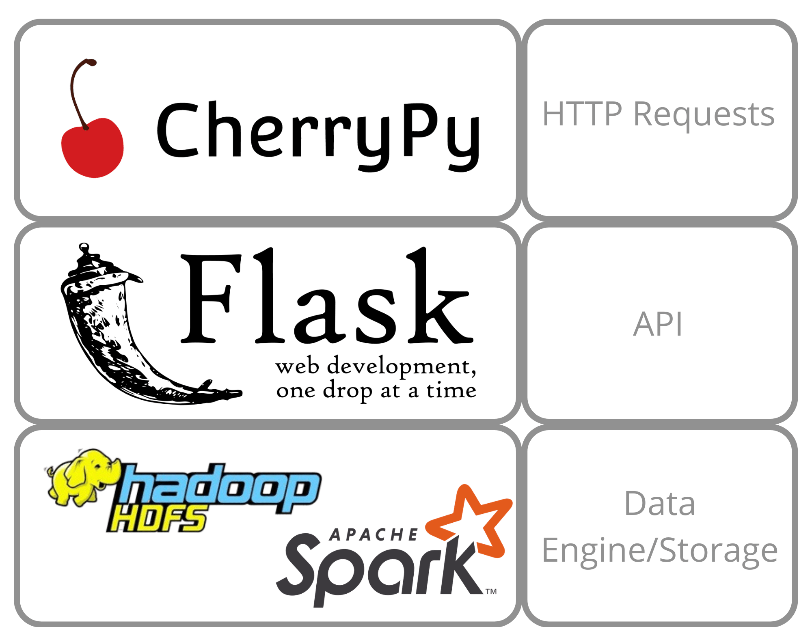

**Introduction**

When developing AI systems, we are interested in spending time and energy extracting value from the data. Building the architecture that delivers the solution to the end-user should not dominate the development cycle.  By including a robust predefine architecture in the SparkPlug framework, ML scientists can build full-fledged apps while focusing on what matters most. 

In the rest of this section, we will focus on the qualities and components of the SparkPlug architecture. 

  

**Microservices**

All SparkPlug apps are fully self-contained microservices. From both developmental and operational perspectives, the microservice is a highly effective architectural paradigm.

First, let's look at the development side. AI is a niche area, and developing these systems as microservices allows organizations to organize around their capabilities. The data science team can focus on solving data-oriented problems and creating value without wasting time integrating into a messy monolith. For some organizations, it makes sense to outsource AI components to external entities, as was the case with GeoPredict. As an external actor developing GeoPredict as a microservice, I delivered a product without needing to access or understand my partner's internal systems. Through this approach, I streamlined development while alleviating security concerns.

While I tout microservices for highly specialized applications like AI, it is becoming an essential architecture in a broader sense. Internal teams are becoming more and more like external actors as software products grow in complexity and require more engineers to build them.

Finally, I would like to highlight some critical operational attributes that make microservices awesome:

*   Scalable – deploy to multiple nodes and run a load balancer
*   Maintainable- decoupled from primary service
*   Reliable – decoupled (less stuff can break)

**Handling Big Data** 

Many machine learning tasks rely on running optimizations on big data sets, which require a great deal of computation. Ideally, to maximize performance, we want to parallelize the tasks across many compute cores and keep the data in memory instead of on disk. It is much cheaper to access cores and memory by using a lot of commodity hardware instead of getting specialized, high-powered machines. 

Writing multithreaded applications on one machine is hard enough but writing one that works across multiple devices is a behemoth task.

Luckily, distributed computing engines provide a clever abstraction. We write the application in a traditional single-threaded manner and let the framework distribute the computation across logical cores and physical devices. One high-performance engine/framework is Spark. SparkPlug (which I hope is evident from the name) is just a further abstraction of Spark itself to make it much easier to write ML applications. 

Why Spark in particular? Spark works in memory instead of on disk (cough cough MapReduce), making it very fast. Aside from its excellent performance, Spark has widespread adoption in the industry and has a rich set of libraries that accelerate development. When writing GeoPredict, I used SparkSQL instead of vanilla Spark because I was already familiar with SQL, ultimately saving much time and reducing the barrier to entry.

  

**Empowering Interoperability** 

SparkPlug maximizes interoperability by communicating with external systems through a RESTful API. Why?

Most of the world's data comes from web services. The service that processes this data should also be a web service- it fits nicely within the ecosystem. For example, to demonstrate the GeoPredict algorithm's power, my colleague wrote an iOS application that sent location data and requested predictions. Thanks to the RESTful API, my partner was able to integrate GeoPredict on SparkPlug with her app in a matter of hours!

Additionally, given HTTP's ubiquity, we are almost guaranteed compatibility with legacy architecture and developer familiarity. No learning curves here! While some microservices use a different communication protocol internally and externally, with HTTP, we benefit from defining a single API that works for both. We also benefit from using HTTPS for secure data transmission and employing well-established tokenization practices for user authentication if needed.

  

**SparkPlug Developer Technology Stack** 

Now we will dive into the technology stack that powers the framework we have discussed thus far. These are all the components that SparkPlug developers interact with hands-on. 

At the top, we have CherryPy, a lightweight Python-based HTTP web server that gets automatically deployed alongside the SparkDriver node in a SparkPlug application. CherryPy handles incoming requests and responses from the data application. Developers need not interact with this directly. 

On the next level, we have Flask. Using Flask, we build out our RESTful API- also, as you may have guessed, in Python.  It acts as the glue between our Spark functionality and raw HTTP requests. We use Flask decorators to specify the correct HTTP REST endpoint and then call and pass data to the one-to-one mapped PySpark functions.  

Each PySpark function is then passed to the Spark cluster to be processed across the compute nodes. We will discuss this a lot in the next section, so sorry if it's a bit confusing now. 

I hope you noticed my love for snakes! The choice is not random. Many developers, including myself, prototype using Jupyter notebook and libraries like Pandas, so it is only natural to make the whole stack Pythonic. It is the bread and butter of ML developers.

  

**Conclusion**

So far, we have explored the technology and recipe behind SparkPlug applications. Using this recipe, data scientists are empowered to rapidly develop Spark applications as microservices. The next section will discuss the framework's deployment and operational strategies and bring a fuller picture of how different parts of the technology stack are distributed across compute clusters.
